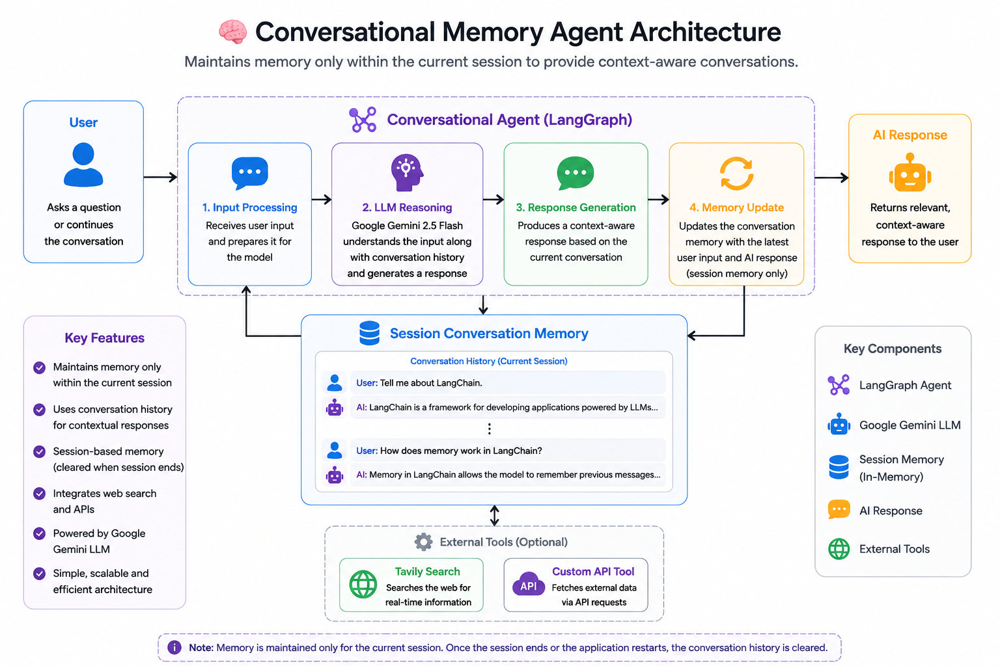

# 🧠 Conversational Memory Agent

<p align="center">
  <strong>
    An AI-powered Conversational Agent built with LangChain, Google Gemini, and Session-Based Memory to maintain contextual conversations throughout the current interaction.
  </strong>
</p>

<p align="center">
  
  
  
  
  
  
  
</p>

<p align="center">
  
</p>

---

# 📖 Overview

This project implements an intelligent **Conversational Memory Agent** that maintains conversation history throughout the current chat session to generate more natural and context-aware responses.

Unlike traditional chatbots that process each prompt independently, this agent remembers previous interactions within the active session. It uses the stored conversation history to understand references, follow-up questions, and ongoing discussions before generating responses with **Google Gemini 2.5 Flash**.

Built using **LangChain** and **LangGraph**, the project demonstrates how session-based conversational memory can be integrated into modern AI applications to create more coherent and engaging conversations.

---

# ✨ Features

- 💬 Session-based conversational memory
- 🧠 Maintains conversation history throughout the current session
- 🤖 Context-aware responses using previous interactions
- ⚡ Powered by Google Gemini 2.5 Flash
- 🔄 Automatic memory updates after every conversation
- 🌐 Optional web search integration using Tavily
- 🧩 Built using LangChain and LangGraph
- 🚀 Lightweight and extensible architecture

---

# 🏗️ Architecture

```text
                         User Message
                               │
                               ▼
                  LangGraph Conversational Agent
                               │
         ┌─────────────────────┼─────────────────────┐
         │                     │                     │
         ▼                     ▼                     ▼
  Current User Input     Session Memory       Gemini 2.5 Flash
         │                     │                     │
         └───────────────┬─────┴─────────────────────┘
                         ▼
                Context-Aware Response
                         │
                         ▼
              Update Session Conversation Memory
                         │
                         ▼
                    Return Response
```

---

# ⚙️ Workflow

1. Receive the user's message.
2. Retrieve the conversation history from the current session.
3. Combine the latest message with previous interactions.
4. Send the complete conversation context to Google Gemini.
5. Generate a context-aware response.
6. Update the session memory with the latest interaction.
7. Return the response to the user.

> **Note:** Memory is maintained only during the active conversation. Once the session ends or the notebook restarts, the conversation history is cleared.

---

# 🛠️ Tech Stack

| Category | Technology |
|----------|------------|
| Language | Python |
| Development Environment | Google Colab |
| Framework | LangChain |
| Workflow | LangGraph |
| LLM | Google Gemini 2.5 Flash |
| Memory | Session-Based Conversation Memory |
| Web Search | Tavily Search *(Optional)* |

---

# 📂 Project Structure

```text
Conversational-Memory-Agent/
│
├── assets/
│   └── architecture.png
│
├── Conversational_Memory_Agent.ipynb
├── README.md
├── requirements.txt
└── LICENSE
```

---

# 🚀 Getting Started

## Prerequisites

- Python 3.10+
- Google Colab (Recommended)
- Google Gemini API Key
- Tavily API Key *(Optional)*

---

## Install Dependencies

```bash
pip install -r requirements.txt
```

---

## Configure API Keys

Store the following secrets in **Google Colab**:

```text
GEMINI_API_KEY
TAVILY_API_KEY
```

No API keys are hardcoded inside the notebook.

---

## Run the Project

1. Open `Conversational_Memory_Agent.ipynb` in Google Colab.
2. Configure the required API keys.
3. Run all notebook cells.
4. Start chatting with the agent.
5. Observe how it remembers previous messages within the current session.

---

# 💬 Example Conversation

**User**

> My name is Prahladh.

**Assistant**

> Nice to meet you, Prahladh!

---

**User**

> What did I tell you my name was?

**Assistant**

> You told me your name is Prahladh.

---

**User**

> Explain LangChain in simple terms.

**Assistant**

> *(Provides an explanation while maintaining conversation context.)*

---

# 🔮 Future Improvements

- 🗄️ Persistent memory across sessions
- 📚 Long-term vector memory
- 🌐 Streamlit / Gradio interface
- 👥 Multi-user support
- 📖 Conversation summarization
- 🔍 Hybrid memory retrieval
- 🤖 Support for multiple LLM providers
- ☁️ Docker deployment

---

# 👨‍💻 Author

**Prahladh Vulsa**

GitHub: **https://github.com/Prahladh-Vulsa**

---

<p align="center">
⭐ If you found this project useful, consider giving it a star!
</p>
